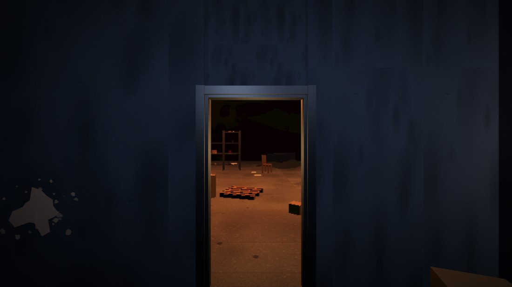
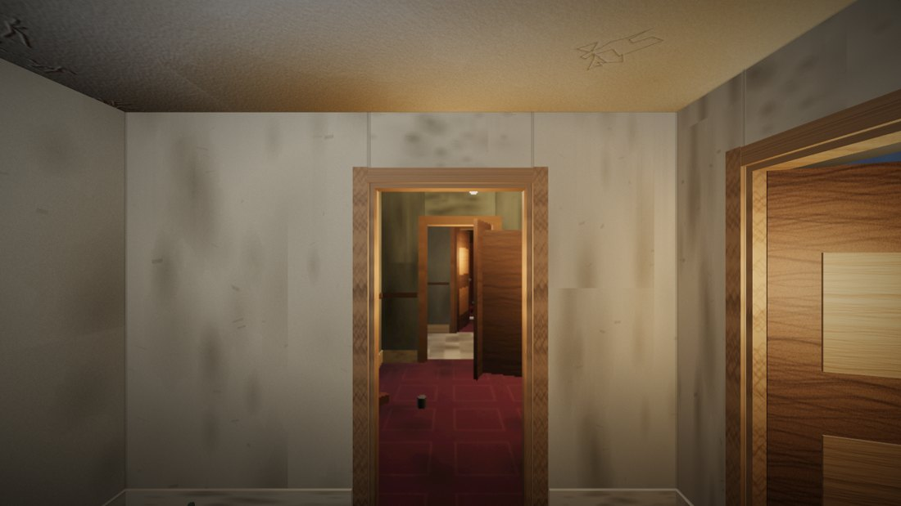

# Wittgenstein 3D

**[Play it →](https://micknoise.github.io/wittgenstein3d/)**

A first-person exploration demo. You are somewhere domestic and worn — wallpaper with damp coming
through it, a lamp doing most of the work, mugs somebody left on a table. Behind one of the doors is
a room that cannot be there, and you can see into it before you walk through.

No narrative, no NPCs, no combat, no fail state. The subject is perception and the uncanny: rooms
you did not expect, doors that go nowhere, a warehouse behind a terraced house. It takes after Mike
Nelson's constructed interiors, the parts of *Half-Life* the Backrooms came out of, and the dream in
which your own house has a corridor you have never seen.

The whole thing is one HTML file with no external requests. Every texture is drawn onto a canvas at
load time; there are no image assets anywhere.



*A storeroom. Through the door, a warehouse that is nowhere near it.*

---

## Controls

| | |
|---|---|
| **WASD** | walk (shift to hurry) |
| **mouse** | look |
| **click** | take — it hovers at arm's length, still physical |
| **right-click** / **F** | throw |
| **wheel** | push the held object away / pull it closer |
| **E** | open a door |
| **Esc** | release the mouse |

Desktop only — it uses pointer lock.

---

## The building is generated

Every house is built from a seed, shown on the title screen. `?seed=424242` loads that one again;
**another house** on the title screen rolls a new one.

The *vocabulary* is authored and the *building* is generated. That distinction is the whole design:
noise-based generation gives you endless plausible nothing, and the dread here depends on rooms
being recognisable — a specific front room, a specific storeroom — and then being where they cannot
be. So there are nine room types with size ranges, materials, lighting kinds and rules about what
tends to be in them and where; the generator decides which rooms exist, how big they are, how they
connect, what is in them and how worn they are.

Rooms attach to one another's free walls and are rejected if they would overlap. Contents are placed
against an occupancy grid — wardrobes and sideboards against walls, lamps in corners, mugs on the
tables they belong on — so nothing lands inside anything else and the doorways stay clear.

## Two of the doors are not doors

They are portals. Each face renders the view out of its twin into a texture, mapped back onto the
opening in screen space with an oblique clip plane, so you *see* the other place through the doorway
and it parallaxes correctly as you move. Walk through and you are moved and turned by the transform
that takes one frame to the other, keeping your speed and whatever you are carrying. Objects go
through too — throw a mug at one and it arrives, turning as the space turns — which matters more
than it sounds, because leaving objects in rooms is how people work out what the building is doing.

One passage in every house returns to itself: both its ends are the same doorway, so you can walk
down it as long as you like and never leave it. Looking along it, you see the corridor receding into
itself.

This is what lets space stop adding up. Because the two sides are never connected in world space,
the generator can put the far side anywhere at all — including a warehouse larger than the entire
house, reached through an internal wall.



*A kitchen. Through the door, a landing from the other end of the house.*

---

## Building it

```sh
npm install
npm run build      # bundles three.js, cannon-es and src/ into index.html
npm test           # 63 checks against 5 different seeds, headless
npm run perf       # draw calls and triangles per room; fails over budget
npm run shots 1234 # renders every room and every portal of that building
npm run music 1234 # draws that house's score to wav, and measures it
```

`index.html` is the build output and is committed, so GitHub Pages serves it directly. There is no
build step for anyone who just wants to play it.

## Layout

| | |
|---|---|
| `src/00-textures.js` | every surface, drawn onto canvases at load; grime and decal layers |
| `src/05-rng.js` | the seeded random source |
| `src/10-types.js` | the vocabulary: room types, what is in them, where it goes |
| `src/15-generate.js` | the generator — layout, connections, dressing, portals |
| `src/20-build.js` | turns a plan into geometry and rigid bodies |
| `src/25-portal.js` | portal rendering and traversal |
| `src/30-player.js` | the body, the hands, the doors |
| `src/35-vision.js` | perception: one full-screen pass, driven by how far in you are |
| `src/38-music.js` | the score: generated, and played by what you do |
| `src/40-main.js` | sound, screen, loop |
| `shell.html` | the page the build is injected into |
| `SPECIFICATION.md` | what it is meant to do, as a checklist someone can assess it against |

A generated building and a hand-written one are the same kind of thing — the generator emits exactly
the `SPACES` structure the builder consumes, so you can still author a level by hand.

There is a console handle on `window.VK`: `VK.go(x,y,z,yaw,pitch)` teleports, `VK.goSpace(key)` jumps
to a room, `VK.aimAt(x,y,z)` points the camera, `VK.tick(n)` runs *n* physics frames without
rendering, `VK.openAll()` opens every door, `VK.spaces` is the plan.

## One window

Every space is an interior except for one. Somewhere in each house there is a window, and outside it
there is nothing — no ground, no sky, nothing to judge a distance against. The house stops at the
glass. Daylight comes through it anyway, in a shaft down onto the floor, and nothing out there
accounts for it.

## You are not seeing this very well

One full-screen pass, and the defect is in the person looking rather than in a
camera: visual snow, surfaces that will not hold still, a periphery that softens
and closes in, edges separating into colour, and the last bright thing you
looked at still hanging about after you have looked away.

It gets worse the further in you are — not in metres, in **doors**. Depth is
breadth-first steps from the room you woke up in, and a portal counts double:
you have not walked further, but you have been taken further.  shows
the raw render.

## The score

There is music, and it has no existence of its own. It is a reading of what you
are doing, and if you stand still and touch nothing it stops — the throb inside
two seconds, the drone under it after sixteen, and then the building is as quiet
as it was before you arrived.

There is no melody in it and deliberately no arpeggiator. What walking drives is
a **throb** — one distorted low note on an odd metre, with no tune in it to
like — and a stutter gate that flickers the drone. Every eighth footstep
re-rolls both patterns, so what you are hearing is still something you walked
into being. Nothing is a major chord: rooms own dissonances, and the drone
always has a semitone or a tritone rubbing against it.

Taking an object gives you a note to carry and putting it down ends it. Throwing
one is a dissonant cluster. A door moves the harmony, because a door is the
strongest instrument in the building. Every room owns a chord, hashed from its
name and the seed, so the front room sounds like the front room every time you
are in it — which is exactly the evidence somebody marking rooms with mugs is
trying to collect. The further in you are, the slower, dirtier and heavier it
gets, and something climbs that never arrives anywhere and is sometimes cut off
part-way up, leaving a hole.

Crossing a fold makes no sound at all, and nothing in the score is allowed to
line up with one.

It is wired into the picture: the throb lifts every lamp in the room a few per
cent and pushes the perception pass, the weight underneath closes the field of
view in and thickens the fog, a bell pulls the colour apart and leaves a longer
after-image, and the stutter takes the lights with it — the flicker in the drone
and the bad bulb in the ceiling are the same event, and nothing explains either.
All of it is exactly zero until the music starts, so a build with the score
renders the same pixels as one without.

What the score is allowed to do to the picture is bounded: the terms are
additive, so a player rushing through the house — a bell in every room, a swell
at every door, over a throb that never stops — would otherwise sit near the top
of all of them at once. Past a fixed ceiling the whole set is scaled back in
proportion, so a busy moment is *denser* than a quiet one rather than brighter.

And it runs the other way as well: how hard the perception pass is working —
how far in you are, times `?fx=N` — drives the score's distortion. Turn the pass
up and the throb, the grit, the crackle and the wow across the whole mix all
come up with it; turn it down and the music cleans up. The two halves are one
thing happening to one person.

`?nomusic=1` turns the score off, `?fx=N` scales both halves at once, and
`npm run music` draws the score to a wav so it can be listened to away from the
game, with how loud and how dark it is printed alongside.

## Keeping it fast

The building is drawn a room at a time. Rooms are groups, and only the one you are in, the ones it
opens onto and anything two steps out that is actually on screen get drawn at all. Everything in a
room that never moves is merged into one piece of geometry per material, which took the worst room
from 334 draw calls to 173 — objects you can pick up stay separate, because you navigate by them.

Lights are descriptions rather than lights: a fixed pool of twelve is filled each frame from
wherever the camera is, scored by what each one actually contributes there, and two of them cast
shadows. Shadow maps are redrawn only when something has moved. Pixel ratio adapts to keep the
frame. `npm run perf` reports draw calls and triangles per room and **fails** above a stated budget,
so none of this quietly comes undone.

## Known limitations

- Portals are single-bounce: one seen through another renders black.
- Doors are animated rather than simulated; a leaf stops being solid the moment it moves.
- One storey, axis-aligned rooms. There are stairs, but no upstairs — the door at the top of a
  flight is a portal back to the ground floor.
- No inventory and no gating yet: everything is takeable and nothing is required.
- The score is stereo but not positional: it happens to you, not in the building.

## Built with

[three.js](https://threejs.org) and [cannon-es](https://github.com/pmndrs/cannon-es), both bundled
into the single output file.
